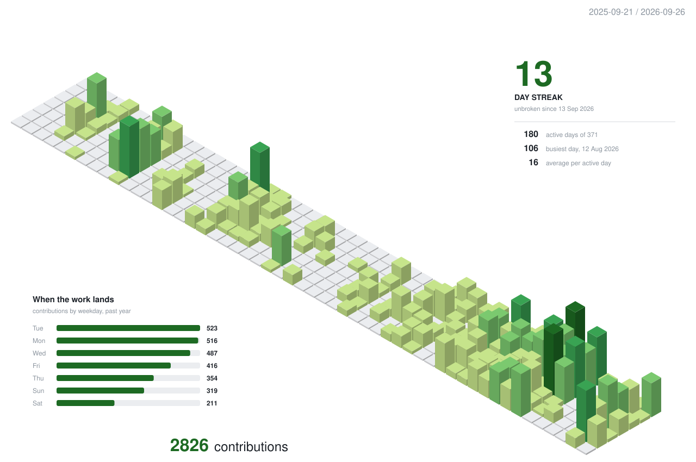

<h2>Eric Kang</h2>

  Medical imaging, applied AI, and robotics. Most of what I build lives in private
  org repos, so the numbers below are generated from the GitHub API rather than
  scraped off my public profile.

<picture>
  <source media="(prefers-color-scheme: dark)" srcset="./profile-3d-contrib/profile-night.svg">
  
</picture>

<picture>
  <source media="(prefers-color-scheme: dark)" srcset="./assets/stats-dark.svg">
  
</picture>

### What I work on

| | |
|---|---|
| **[VNE Medical Technologies](https://vnemedtech.com/)** | AI-powered medical imaging and clinical decision support — turning scans and clinical data into something a clinician can act on. Tendon-tear detection (TearSense), spine and IR vectorization, segmentation tooling. |
| **[Ladiate](https://www.ladiate.com)** | Applied AI products and the platforms around them — the Elevis stack, LOSA, and assorted internal tooling. |
| **[Claw For Humanity](https://clawforhumanity.ca)** | Assistive and recycling robotics. ReSolve's operating core (Hawk OS / Hawk-Brain), ROS 2 + MoveIt motion planning, and ML sorting built on Google CircularNet. |
| **[Garibaldi Robotics](https://github.com/Garibaldi-Robotics)** | FIRST Robotics Competition — 2023 and 2024 seasons, in Java. |
| **[Amusely Music](https://github.com/AMUSELY)** | Music tech. |

Also on my own: [`ORI-RCRTEPRS`](https://github.com/erickdhdock/ORI-RCRTEPRS) (rotator-cuff
re-tear estimation after reconstruction surgery),
[`bodylang`](https://github.com/erickdhdock/bodylang) (body-language detection), and
[`mycobot320pi-ros2-moveit`](https://github.com/erickdhdock/mycobot320pi-ros2-moveit)
(an unofficial ROS 2 MoveIt 2 node for the myCobot 320 Pi).

---

Both graphics rebuild daily via
<a href="./.github/workflows/profile.yml">GitHub Actions</a>. The 3D chart comes from
<a href="https://github.com/yoshi389111/github-profile-3d-contrib">github-profile-3d-contrib</a>;
the analytics panel is generated by
<a href="./scripts/build_stats.py">a script in this repo</a> that walks every repo I have
access to and counts authored commits directly — <code>contributionsCollection</code> can't
itemize private work. Private repos are aggregated by account and never named;
<a href="./scripts/check_privacy.py">a check</a> fails the build if one slips through.
Raw figures: <a href="./assets/stats.json"><code>assets/stats.json</code></a>.

